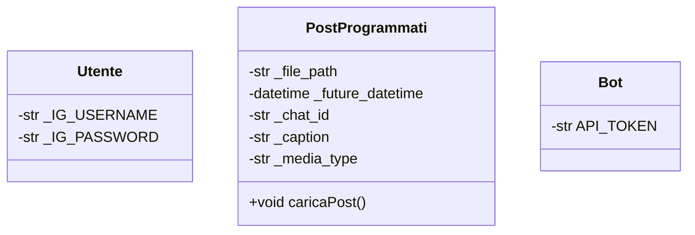

```mermaid
classDiagram
    class Utente {
        -str _IG_USERNAME
        -str _IG_PASSWORD
    }

    class PostProgrammati {
        -str _file_path
        -datetime _future_datetime
        -str _chat_id
        -str _caption
        -str _media_type
        +void caricaPost()
    }

    class Bot {
        -str API_TOKEN
    }

```